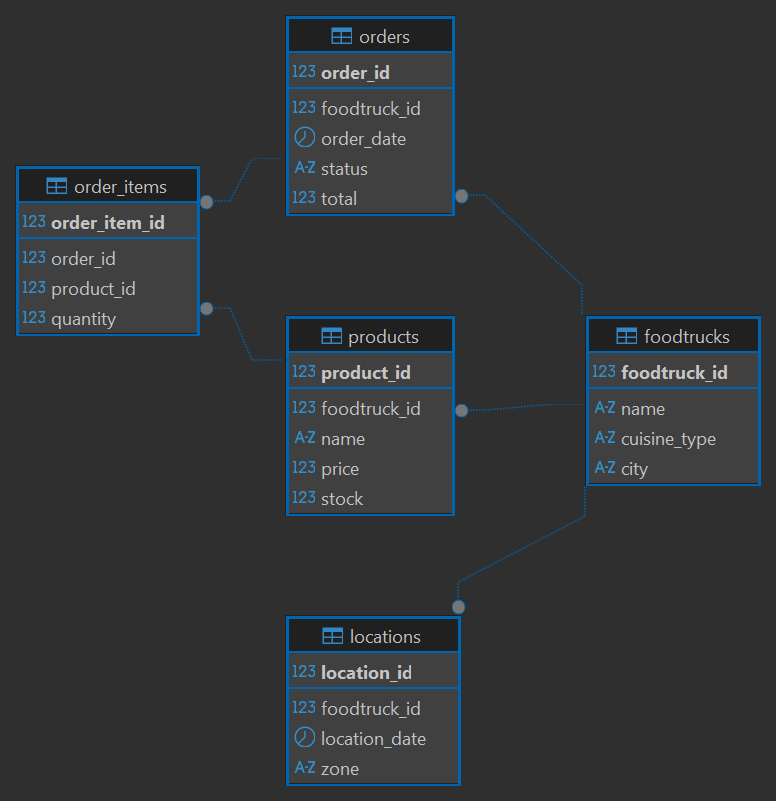

# FoodTrack — Modelo de base de datos relacional

Diseño e implementación de una base de datos relacional en **SQL Server** para
gestionar la operación de una red de food trucks: qué venden, dónde se ubican
cada día, qué productos manejan y cómo se componen los pedidos.

El objetivo del proyecto fue partir de un requerimiento de negocio y traducirlo a
un esquema normalizado, con integridad referencial y reglas de validación a nivel
de base de datos (no en la aplicación).

## Problema que resuelve

Una operación con varios food trucks necesita registrar de forma consistente:

- el catálogo de cada truck y su stock,
- en qué zona y fecha trabajó cada uno,
- los pedidos y su estado (pendiente / entregado),
- y el detalle de productos por pedido.

Si esos datos viven en planillas sueltas se duplican y se vuelven inconsistentes.
La solución es un modelo relacional con claves foráneas que garantizan que, por
ejemplo, no se pueda cargar un pedido de un truck inexistente ni un precio o stock
negativos.

## Modelo de datos



Cinco tablas relacionadas:

| Tabla | Descripción | Relaciones |
|-------|-------------|------------|
| `foodtrucks` | Datos de cada truck (nombre, tipo de cocina, ciudad) | Tabla principal |
| `locations` | Ubicación (zona + fecha) de cada truck | FK → `foodtrucks` |
| `products` | Catálogo y stock por truck | FK → `foodtrucks` |
| `orders` | Pedidos con estado y total | FK → `foodtrucks` |
| `order_items` | Detalle: productos y cantidades por pedido | FK → `orders`, `products` |

Reglas de integridad implementadas:

- **Claves foráneas** en las cuatro relaciones para mantener consistencia.
- **CHECK** en `products`: `price >= 0` y `stock >= 0`.
- **DEFAULT** de `stock` en 0.
- `NOT NULL` en los campos obligatorios.

## Estructura del repositorio

```
foodtrack-db-v2/
├── sql/
│   ├── EjercicioM2T1.sql   # Esquema completo (CREATE TABLE) + datos de ejemplo + consultas
│   └── cambios.sql         # ALTER TABLE (nueva columna) y UPDATE sobre los pedidos
├── csvs/                   # Datos de carga de cada tabla
│   ├── foodtrucks.csv
│   ├── locations.csv
│   ├── products.csv
│   ├── orders.csv
│   └── order_items.csv
└── si-2.png                # Diagrama entidad-relación
```

## Cómo usarlo

1. Crear la base `FoodTruck` en SQL Server.
2. Ejecutar `sql/EjercicioM2T1.sql`: crea las tablas con sus restricciones, inserta
   los datos de ejemplo y corre las consultas de verificación.
3. (Opcional) Cargar los `csvs/` si se quiere trabajar con el dataset completo en
   lugar de los inserts de ejemplo.
4. `sql/cambios.sql` muestra cómo evolucionar el esquema: agrega una columna
   `comentarios` a `orders` con `ALTER TABLE` y la completa con `UPDATE`.

## Tecnologías

- **SQL Server** (T-SQL) — DDL, DML, claves foráneas, CHECK constraints, ALTER TABLE
- CSV como fuente de datos de carga
